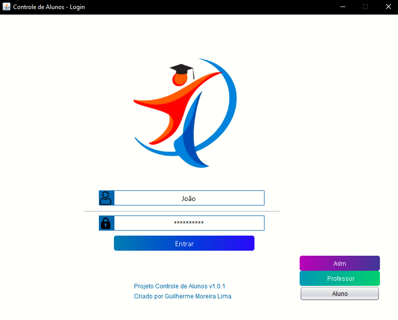
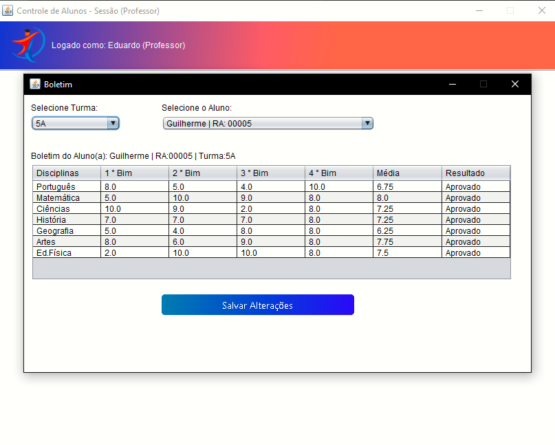

# Projeto Controle de Alunos (Java + MySQL)

Projeto feito na **UNIVERSIDADE NOVE DE JULHO** na aula de **Modelagem e Desenvolvimento Orientado A Objetos** e **Projeto em Desenvolvimento de Sistemas**, administradas pelo professor ***Evandro Teruel***.  

O objetivo do projeto era desenvolver um software simples e qualquer em Java, com o pré-requisito de uma integração ao banco de dados MySQL.

## 

